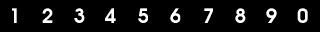

Affichage de sprites avec la SDL, partie 1
==========================================

Introduction
------------

Cet article est le premier d'une série dans laquelle nous allons
étudier, depuis le début, l'affichage de sprites avec la SDL. Pour
rappel, un sprite est un morceau d'image qui peut être déplacé, déformé
et animé sur l'écran.

Avant de commencer la lecture de celui-ci, je vous conseille de lire
"Première application en C avec la SDL" sur ce même site, qui explique
les bases de l'initialisation d'un programme en SDL.

Au cours de cette série d'articles, nous verrons comment afficher des
morceaux d'images à l'écran, comment les animer, les déplacer avec les
touches du clavier, ainsi que probablement d'autres choses, seul le
premier article étant écrit pour le moment. Dans cette première partie,
nous allons partir d'une application affichant une série d'images, nous
allons ensuite voir comment gérer leur vitesse d'affichage, puis comment
afficher plusieurs instances d'un même type de sprite animé.

Les trois programmes sont disponibles dans l'archive fournie avec cet
article. Afin de les compiler, vous devez avoir la librairie SDL
installée et savoir comment compiler un programme avec cette librairie.
Si vous utilisez gcc sous un environnement Linux/Bash,
vous compilerez très simplement
chaque programme de la manière suivante :
``gcc -o sprites1 sprites1.c `pkg-config sdl --cflags -libs` ``.
                                                               
Si vous utilisez `fish`: `gcc -o sprites1 sprites1.c (pkg-config sdl --cflags --libs | string split " ")`

Et de même pour les sources `sprites2.c` et `sprites3.c`.

Première phase
--------------

Le but du premier programme est d'afficher une suite d'images qui
composeront l'animation de notre sprite. Je ne suis pas graphiste, la
séquence d'animation se compose donc tout simplement d'images de 32
pixels sur 32 pixels avec les chiffres 1, 2, 3, 4, 5, 6, 7, 8, 9 et 0
mises bout à bout.

Cela donne ceci :



Afin d'afficher l'animation, nous pouvons partir du squelette de
l'application SDL de base (cf. article précédent) et nous devons y
ajouter :

- le chargement de l'image ;
- l'affichage cyclique de l'image.

Comme précédemment, la fonction `main()` initialise tout d'abord `SDL`
avec la fonction `sdl_init()` qui renvoie une surface, elle-même passée
à la boucle principale `main_loop()`.

Comme les trois programmes doivent initialiser la `SDL` et charger une
image, ces deux fonctions sont déplacée dans le fichier `common.c` pour
réutilisation.

### Charger l'image

La SDL offre une fonction permettant de lire un fichier au format BMP.
De base, on ne peut utiliser que ce format. Il existe des librairies qui
étendent la SDL pour lire d'autres formats, et la SDL elle-même est
assez versatile pour que l'on puisse soit même implémenter le chargement
de formats autres. Nous ne nous servirons ici que des fonctions de base
de la SDL, nous chargeons donc une image BMP.

La fonction prend en paramètre le nom de l'image, et renvoie un pointeur
sur une `SDL_Surface`. C'est tout simple. On vérifie juste que le
pointeur est bien différent de NULL, ce qui signifierait qu'une erreur
est apparue lors du chargement.

**Attention** : même si cela peut sembler peu important dans un programme
aussi court, il faut penser à libérer ce qui a été alloué. Cela évite
de mauvaises surprises lorsque l'on réutilise cette base dans un programme
qui grandit. À la sortie de la boucle, on appelle donc `SDL_FreeSurface()`.

Juste avant le début de la boucle principale, on pré-remplie la variable
`source_rect`, de type `SDL_Rect`. En effet, à chaque
fois qu'un sprite sera affiché, il aura des dimensions de 32 par 32
pixels, et son coin supérieur gauche est en haut de l'image. C'est ce
que signifie le code suivant.

```
SDL_Rect source_rect = { 0, 0, 32, 32 };
```

### Boucle principale

Nous n'observons ici qu'un seul événement : la demande de fermeture du
programme.

Puis on affiche le sprite en lui-même. Pour cela, on doit trouver la
position dans notre image de l'étape actuelle que nous voulons afficher.
La position est contenue dans la variable `displayedSpriteIndex`, et les
étapes font chacune 32 pixels de large. La position en x de l'image à
afficher est donc `displayedSpriteIndex * 32`.

L'affichage en lui-même se fait par la fonction `SDL_BlitSurface`. Cette
fonction recopie un morceau d'une `SDL_Surface` vers une autre
`SDL_Surface`. Cela tombe bien, nos deux éléments graphiques, l'image
contenant les sprites et la surface d'affichage sont de type
`SDL_Surface`.

`SDL_BlitSurface` prend quatre paramètres.

- premier paramètre : il s'agit de la surface source. Ici, nous
  prenons notre sprite dans l'image que nous avons chargée, le
  paramètre est donc `loadedPicture` ;
- second paramètre : c'est un pointeur vers une variable de type
  `SDL_Rect` qui représente le rectangle que nous allons « découper »
  dans la surface en premier paramètre pour la copier ;
- troisième paramètre : il s'agit de la surface cible. Ici, c'est la
  surface d'affichage : `screen` ;
- quatrième paramètre : c'est aussi un pointeur vers une variable de
  type `SDL_Rect`, qui donne la position dans la surface cible vers
  laquelle sera copiée l'image. Ici, le paramètre mis à `NULL` signifie
  que l'on ne s'en préoccupe pas, et que la position sera `(0,0)`.

Maintenant qu'on a affiché cette étape, on incrémente le numéro de
l'étape d'animation a afficher et on teste s'il n'a pas dépassé le
numéro de la dernière étape, auquel cas on le remet à zéro.

Un appel à `SDL_Flip()` permet l'inversion du double buffer, et c'est
repartie pour un tour.

### Résumé

Ce programme a initialisé une surface d'affichage, a chargé une image
contenant plusieurs sprites représentant une « animation » puis les a
affiché tour à tour par « blit ». Ce programme très basique présente un
problème évident que nous allons corriger par la suite : la vitesse de
l'animation n'est pas régulée, elle va aussi vite que l'ordinateur peut
aller. La seconde étape va présenter une méthode permettant de régler ce
problème.

Deuxième phase
--------------

Dans ce deuxième programme (`sprites2.c`), nous allons présenter une manière de
contrôler la vitesse de l'animation de sprite.

On pourrait être tenté de mettre une boucle d'attente
après le `SDL_Flip()`, pour ralentir l'exécution. Voici comment cela
pourrait être fait :

    int heure_actuelle;

    heure_actuelle = SDL_GetTicks();
    while(heure_actuelle +1000 > SDL_GetTicks());

`SDL_GetTicks()` retourne le nombre de millisecondes écoulées depuis
l'initialisation de la SDL. Ici, on note la valeur actuelle, puis on
boucle jusqu'à ce que cette valeur plus 1000 soit dépassée par la
nouvelle « heure ». On attend donc une seconde avant de continuer le
programme.

C'est peut-être une bonne idée si votre programme ne fait qu'afficher un
seul sprite, mais je suis persuadé que votre programme fera autre chose,
comme afficher d'autres sprites, calculer des déplacements, jouer des
sons,...

Nous allons donc faire légèrement différemment. Plutôt que de bloquer le
programme avec une boucle, on va effectuer le test seul. Si le test est
vrai, on ne fait rien de spécial, on continue une nouvelle boucle
d'affichage complète. S'il est faux, alors c'est qu'il faut modifier le
numéro de l'étape d'animation du sprite.

On a deux variables. La variable `currentTime` contient l'heure actuelle,
obtenue avec `SDL_GetTicks()`. La variable `nextUpdateTime` contient
l'heure à laquelle devra être effectué le prochain changement d'étape
d'animation du sprite.

Si `currentTime` dépasse `nextUpdateTime`, c'est qu'il est temps de
changer. On incrémente `displayedSpriteIndex`, on test si la valeur
maximale n'a pas été atteinte, et on fixe la nouvelle heure de
changement d'état, ici 500 millisecondes plus tard.

Puis on continue.

### Résumé

Nous avons à présent une méthode qui permet de régler la vitesse
d'animation d'un sprite sans bloquer le fonctionnement du programme.
Parfait, nous allons donc pouvoir afficher plusieurs sprites animés !

Troisième étape
---------------

Dans cette dernière étape de cet article, nous allons afficher plusieurs
instances du même sprite animé. Chaque instance possède sa propre
position sur la surface d'affichage ainsi que sa propre vitesse. Grâce à
l'étape précédente, nous allons pouvoir gérer tous ces sprites
indépendamment.

Afin de stocker ces informations simplement, nous utilisons une
structure 'Sprite' dont la définition est la suivante :

```C
typedef struct Sprite_t
{
    SDL_Surface* source;
    int nextUpdateTime;
    int16_t destX;
    int16_t destY;
    uint16_t speed;
    uint8_t step;
} Sprite;
```

- `source` est le pointeur vers la surface de l'image chargée
  contenant les images du sprites ;
- `nextUpdateTime` est l'heure du prochain changement d'étape pour ce
  sprite ;
- `dextX` et `destY` sont les coordonnées du sprite dans la surface
  d'affichage ;
- `speed` est une variable un peu mal nommée, il s'agit en fait du
  nombre de millisecondes entre deux états de ce sprite ;
- `step` est le numéro de l'étape d'affichage. En effet, comme nous
  voulons que les vitesses des sprites soient indépendantes, chacun
  des sprites aura son propre état actuel.

Le traitement spécifique de la mise à jour et affichage du
sprite est retiré de `main_loop()`. Tout cela est
remplacé par un tableau de pointeurs sur des structures de type
Sprite. Le tableau a une taille de `NB_SPRITES`, qui est le nombre de
sprites que nous allons afficher.

Ce tableau est rempli en appelant la fonction `create_random_sprite()` qui
a pour paramètre le pointeur vers la surface de l'image chargée. La
fonction `create_random_sprite()` se charge de :

- allouer la place pour la structure du sprite, avec malloc() ;
- initialiser les valeurs de ce sprite. La vitesse et les coordonnées
  sont des nombres aléatoires.

À propos de ces nombres aléatoires, nous avons initialisé le générateur
de nombres aléatoire avant la création de sprites, avec
`srand(SDL_GetTicks())`, et une fonction `get_random()` a été ajoutée
pour tirer un nombre entier entre deux bornes.

La boucle principale du programme doit maintenant afficher chaque sprite
contenu dans le tableau. Pour cela, nous faisons une boucle qui traverse
le tableau et appelle la fonction `display_sprite()` avec pour
paramètres la surface d'affichage, la structure du sprite concernée et
l'heure actuelle, que nous avons obtenue juste avant la boucle.

*Note* : ne relever qu'une seule fois la date actuelle est non seulement
plus efficace (car cela évite d'appeler trop souvent `SDL_GetTicks()`)
mais permet de s'assurer que tous les sprites sont modifiés avec la même
heure.

Après avoir affiché le sprite, on met à jour les paramètres de la
structure en veillant à bien séparer ce traitement de l'affichage,
dans une fonction `update_sprite`.

La mise à jour est fait de façon identique à ce que l'on a fait dans le
programme précédent. Mais les variables utilisées pour le test et la
mise à jour sont celles de la structure de sprite. Ainsi chaque instance
de ce sprite est indépendante.

### Petit ajout

En sortant de la boucle, principale, en plus de libérer la surface
contenant les sprites, on libère aussi chaque structure de type Sprite
précédemment allouée.

### Résumé

Dans cette troisième phase, nous avons vu que grâce à une temporisation
qui ne bloque pas le programme, nous pouvons afficher plusieurs fois le
même sprite dans des états différents, et de façons indépendantes les
unes des autres.

Les problèmes : vous ne l'avez pas forcément vu tout de suite, mais ce
troisième programme présente un nouveau problème. Afin qu'il soit
beaucoup plus visible, augmentez le nombre de sprites affichés en
modifiant `NB_SPRITES`. Mettons à 100.

Vu ?

Les sprites qui s'affichent l'un sur l'autre s'écrasent ! En effet, nous
affichons le sprite dans son intégralité, avec la couleur noire comme
une vraie couleur noire, et aucune couleur « transparente ». Ça n'est
pas gênant si les sprites que nous voulons afficher ne s'affichent pas
les uns sur les autres, mais cela sera rarement le cas, à moins d'avoir
un sprite parfaitement rectangulaire, sans transparence.

Le deuxième problème n'est pas visible dans ce troisième programme, mais
le serait si nous voulions bouger les sprites sur l'écran. Contrairement
à l'article précédent, nous n'effaçons pas la surface d'affichage à
chaque début de boucle. Résultat, si les sprites bougeaient, ils
laisseraient derrière eux une trace.

Nous verrons comment améliorer ça dans l'article suivant.

À bientôt pour la seconde partie de cette série d'articles.

Crédits 
--------

- Tutorial écrit par [Mokona](https://www.puupuu.org) écrit pour Prografix.
- Date de publication : 28 avril 2003
